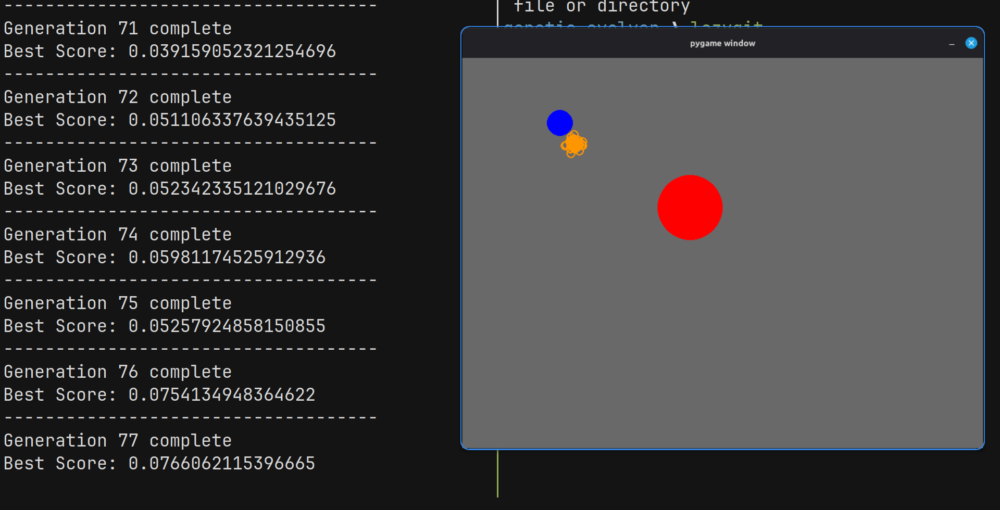

# Genetic Evolver

A Pygame simulation where rockets learn to navigate around obstacles to reach a target using a **genetic algorithm**.



## How it works

Each generation, **50 rockets** are spawned with random **DNA** — an array of 400 movement vectors, each being a random `(dx, dy)` shove between -1 and 1. Over 400 frames, every rocket executes its DNA sequentially, one vector per frame, moving around the screen.

A red **obstacle** sits in the way. If a rocket collides with it, it bounces off using the collision normal. The goal is a blue **reward** circle on the other side.

## Score calculation

A rocket's fitness is simply its proximity to the reward:

```
score = 1 / (distance_to_reward + 1e-6)
```

The closer a rocket gets to the reward, the higher its score. The tiny epsilon prevents division by zero.

## Evolution process

1. **Evaluate** — Run all 50 rockets for 400 frames and calculate their scores.
2. **Select** — Pick the top 25 highest-scoring rockets as parents.
3. **Crossover** — For each child, randomly pick two parents. For each of the 400 DNA positions, inherit the vector from either parent (50/50 chance).
4. **Mutate** — Each DNA position has a 1% chance to mutate into a random new vector instead of inheriting.
5. **Repeat** — Replace the population with the children and start the next generation.

Over generations, the population evolves to find paths around the obstacle and reach the reward.

## Run it

```bash
python main.py
```

Requires Python 3 and Pygame.
